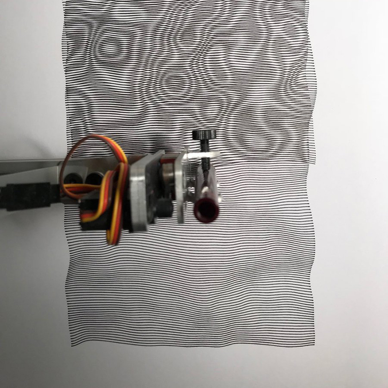

О том, как быть хорошим партнером по команде.

Если бы в вашем распоряжении было 15 минут времени ваших разработчиков, и вашей целью было помочь им стать более эффективными/продуктивными в своей работе, обучив их чему-то, что вы сами знаете, что бы вы выбрали? Перефразируя по-другому, как бы вы могли выполнить обещание Geico: «15 минут могут сберечь вам 15% или более трудозатрат в разработке»? _(Отсылка к рекламному слогану американской страховой компании Geico: «15 минут могут сберечь вам 15% или более на автостраховании» — прим. переводчика)._

Данный пост – мой ответ на этот вопрос. Его чтение займет приблизительно 15 минут, и я верю, что он (помимо других преимуществ) вероятно может сберечь вам сотни часов работы по разработке приложений в течение вашей карьеры. Я считаю, что это самый полезный совет, который я могу дать, и я воодушевлен возможностью поговорить о нем 🙂

Тем не менее речь не о JavaScript, и даже не о программировании в более широком смысле. Мы, как сообщество, провели невероятную работу по оптимизации в инженерной части; у нас есть блестящие фреймворки, инструменты и сервисы. Я работаю на компанию [Gatsby](https://gatsbyjs.com), и мы в первую очередь сосредоточены на том, чтобы сделать разработку многофункциональных, высокопроизводительных, удобных веб приложений значительно быстрее.

Предметная область, на которой мы обычно фокусируемся хорошо обработана и в ней осталось не так много «низко висящих фруктов» (здесь автор статьи использует английское выражение, означающее что-то, чего легко достичь, получить, чем легко воспользоваться – прим. переводчика). Но есть много других сфер, в которых мы можем улучшить наши умения!

Большая часть работы, которую мы выполняем, особенно во фронтенде, тесно связана с продуктом и дизайном. Весьма вероятно, что вы проводите значительную часть своего времени трудясь над претворением в жизнь концепции, с точки зрения, предоставленной другими членами команды. Коммуникация и доверие играют огромную роль в том, насколько эффективно мы работаем вместе, и они могут стать причиной _значительной разницы_ в нашей производительности.

## Радужный путь

Когда-то я работал на [Khan Academy](https://khanacademy.org), некоммерческую организацию с миссией предоставлять бесплатное образование мирового уровня кому угодно и где угодно. Я работал в команде учебного класса, создавая инструменты, которыми должны были пользоваться учителя и их ученики.

Довольно быстро мы обнаружили, что учителям очень не нравится получать обновления продукта в середине семестра: это нарушало течение их рабочего процесса, и отнимало и без того очень ограниченное время. У учителя могло быть только 5 минут до начала урока, чтобы проверить состояние дел у своих учеников. Выпуск продукта нарушал этот процесс.

По этим и многим другим причинам, Khan Academy выстроили структуру большинства своих релизов вокруг учебного календаря: мы нацеливались на запуск новых продуктов в июле-августе, чтобы успеть к новому школьному году (в северном полушарии). Особенно в команде учебного класса мы не могли запустить новые функциональные возможности после начала учебы, поэтому у нас были очень жестко установленные сроки разработки.

В 2018 наша группа работала на проекте с кодовыми названием _радужный путь,_ сосредоточенном на реконструкции инструментов, которыми учителя пользуются вне класса для того, чтобы понять в чем нуждаются их ученики. Наш план был супер агрессивным: мы проводили обновление в 5 ключевых продуктовых областях, и запускали множество новых функций. Какое-то время было даже непонятно успеем ли мы закончить всё вовремя!

В конце концов мы выполнили все наши ключевые обязательства! Как и во многих реальных проектах, потребовалось немного креативного сокращения размаха деятельности, но мы предоставили рабочий продукт вовремя к учебному году, и учителя (и их ученики!) действительно получили пользу от работы, которую мы выполнили.

Я считаю, что в значительной степени мы оказались способны с этим справиться благодаря _сплоченному сотрудничеству,_ которое было у нас между продуктовой-дизайнерской и инженерной командами.

## Три рычага

Продуктовый менеджер однажды сказал мне, что у него есть _три рычага,_ с помощью которых он может улучшить положение, когда работа выполняется с отставанием от графика:

- **Люди.** Если разработчики перегружены объемом работы, которую им необходимо сделать, то добавление дополнительных разработчиков может помочь.
- **Время.** Если работа отстает от графика, мы можем перенести дедлайн!
- **Объем работы.** Если мы вырежем из продукта некоторые вещи, которые не критично, но лишь неплохо было бы иметь в нем, то мы можем сократить объем работы, которую нужно сделать, все еще сохраняя критически важные вещи и решая изначальные задачи.

Первая опция, добавление людей, кажется мне ненадежной. Она может возыметь обратный эффект: подключение дополнительных сотрудников не всегда означает, что работа будет выполнена быстрее. Новым разработчикам нужно собрать определенный объем информации о данном проекте, и иногда такая информация есть только в головах текущих разработчиков. Вместо ускорения процесса, это может замедлить его.

Второй вариант, время, может вообще не быть возможным, особенно, если есть внешние, несдвигаемые дедлайны. По моему мнению это _недостаточно используемый_ рычаг в нашей индустрии, но да, иногда ты на самом деле не можешь перенести срок сдачи проекта.

Это оставляет нам третью опцию, объем работы.

Уменьшение объема работы обычно остается на усмотрение продуктовых менеджеров, но они не принимают такое решение в одиночку. Зачастую все начинается с обсуждения между дизайнером и разработчиком. Если эти два человека доверяют друг другу, то процесс сотрудничества получается сплоченным, теплым и продуктивным. Они находят наилучшее решение в рамках данных ограничений, принимая во внимание время на разработку и особенности пользовательского взаимодействия, и затем предлагают его продуктовому менеджеру. Если продуктовый менеджер доверяет дизайнеру и разработчику, и предложенное ими решение является рабочим с продуктовой точки зрения, то обычно оно принимается без возражений.

Такая организация трудового процесса шикарна, и я считаю, что она была критически важной частью нашего успеха в проекте _Радужный путь:_ если бы мы не были способны корректировать курс со столь малыми разногласиями, то мы никоим образом не смогли бы завершить его вовремя.

Однако такой производственный процесс работает только если все стороны доверяют друг другу.

## Все начинается с эмпатии

Вот вам веселое упражнение. Представьте, что вы на вечеринке и некто спрашивает чем вы занимаетесь. Вы упоминаете, что трудитесь разработчиком в Компании Икс. Собеседник достает свой телефон и заходит на созданную вами домашнюю страницу Компании Икс.

Для многих разработчиков такой момент это повод для гордости. Код, который вы написали, работает на телефоне этого человека! Даже несмотря на то, что множество других людей хорошо потрудились для этого, вы были тем, кто перевел их усилия в реально существующую, интерактивную вещь. Вы были завершающим шагом в процессе, и ваша работа открыта на весь экран.

Теперь представьте себя в той же ситуации, только теперь вы UI/UX-дизайнер, который работал над домашней страницей Компании Икс. Макет, который вы нарисовали несколько месяцев назад, заметно отличается от того, что вы видите на экране телефона этого человека. Шрифты все не те, позиционирование нарушено, на скролле старнный дефект. Это не ваша работа на самом деле. По крайней мере ее можно назвать таковой только с большой натяжкой.

Дизайнеры прилагают много усилий для того, чтобы создать дизайн, который будет прекрасно выглядеть и хорошо работать для конечного пользователя, но их труд проходит сито процесса внедрения, то самое, которое неизбежно оставляет свой след. Конечный результат никогда не будет точно соответствовать их дизайну. Иногда они отличаются, как небо и земля. И в то же время их профессиональная репутация зачастую целиком зиждется на продуктах, выпущенных в реальный мир, а не на том сколько красивых макетов они создали.

Такая ситуация очень легко может привести к обидам и конфиликтам. Я работал в командах, в которых повсеместно была ледяная напряженность между дизайнерами и разработчиками. И, честно говоря, я думаю, что в этом чаще всего виноваты разработчики. Обычно это наша вина.

Стоит признать, что мы не всегда являемся хорошими товарищами по команде. Первый шаг для того, чтобы построить доверительные отношения с нашими друзьями из дизайнерских и продуктовых команд, состоит в том, чтобы показать им, что мы принимаем их проблемы всерьез.

## Придирки

Давайте представим, что мы спокойно работаем над чем-то не очень срочным. Мы отправляем сделанную версию на стейджинг, и день или два спустя мы получаем ответ от дизайнера:

- Измените округление границы аватара с 4px до 8 пикселей
- Добавьте расстояние в 8 пикселей под аватаром
- Центрируйте содержимое между брейкпоинтами 'md' и 'lg'
- Заголовок должен быть цвета 'gray-900', а не 'gray-700'
- Текст должен быть представлен в виде многоточия (…), если он не умещается на трёх строках.

Мы склонны называть такие вещи «придирками» (что, между прочим, не очень хороший способ описать такой тип обратной связи!). Обычно в таких случаях разработчик говорит дизайнеру поставить задачу для этих придирок, где ей, скорее всего, будет присвоен приоритет P4, и она затеряется в море таких же задач с низким приоритетом.

Как мы _должны_ реагировать на такой тип обратной связи?

### Совместное внедрение

В первую очередь мы должны понять сколько времени на наш взгляд займет устранение этих замечаний. Взгляните на список еще раз:

- Измените округление границы аватара с 4 до 8 пикселей
- Добавьте расстояние в 8 пикселей под аватаром
- Позиционируйте содержимое по центру между контрольными точками `md` и `lg`
- Заголовок должен быть цвета `gray-900`, а не `gray-700`
- Текст должен быть представлен в виде многоточия (…), если он не умещается на 3 строках.

Первые четыре поправки звучат обыденно для меня _(если исходить из того, что такие изменения дозволены в рамках дизайнерской системы + компонентной библиотеки — прим. автора)._ Я думаю у меня бы заняло около 5 минут, чтобы исправить их, возможно 30 минут на все, если учитывать все сопутствующие вещи (обновление тестов со снимками, код-ревью и т.д.).

А вот с пятой правкой не всё так просто. Если вы когда-либо имели дело с многоточием для нескольких строк в верстке, вы знаете, что это подлая проблема не имеющая простого решения с помощью CSS. _(Оказалось, что сейчас уже **есть** способ добиться этого с помощью `-webkit-line-clamp`. Тем не менее он работает с ошибками, так что это не идеальное решение. Для целей данной статьи я сделаю вид, что такого способа не существует — прим. автора)._ Вы легко можете провести половину дня пытаясь решить эту проблему, и решение вполне вероятно будет сомнительным.

Вот как бы я поступил в большинстве таких случаев:
- Решил первые 4 проблемы
- Провел исследование и мозговой штурм на тему того, как я могу ответить на оставшиеся вопросы, полученные от дизайнера, без необходимости тратить много часов или дней рабочего времени
- Связался с дизайнером, чтобы получить обратную связь.

Сообщение от меня могло бы выглядеть например так:

> Привет [друг дизайнер],
>
> Спасибо за ответ по [название проекта]!
>
> Я исправил большинство проблем, на которые ты указал, и они будут отправлены на рассмотрение в [разумные временные рамки], но один вопрос неожиданно оказался весьма каверзным: браузеры не предоставляют хорошее встроенное решение для управления отображением многоточия в тексте на несколько строк. Есть сторонние решения, но они причудливые и ненадежные.
>
> У меня есть пара идей для альтернативного решения:
>
> - Можно сделать с помощью CSS многоточие на одной строке - что если мы будем показывать только первую строку?
> - Может быть мы можем ограничить ее каким-то количеством символов? Например, установим максимальный предел в 120 знаков, с добавлением многоточия, если длина строки больше?
> - Возможно мы могли бы зафиксировать высоту контейнера, и добавить в него возможность прокрутки? Таким образом мы все еще могли бы показывать весь текст, но были бы уверены, что он не занимает слишком много места на экране.
>
> Дай мне знать, что ты об этом думаешь!

Ключевой момент здесь в том, что это показывает, что я отношусь к их замечаниям всерьез.

Другой момент: дизайнеры обычно недостаточно знакомы с веб-платформой, чтобы быть в состоянии сказать, что легко и что сложно (да они и не должны, раз уж это _наша_ работа, а не их). Добавление многоточия для нескольких строк текста звучит так, как будто это легко сделать, но мы говорим, что это не так. В сущности мы просим их доверять нам.

Представьте, если бы мне пришлось сказать что-то вроде этого:

> Привет — некоторые из запрошенных тобой изменений сложны, так что я не смогу решить их. Извини.

Дизайнер может задаться вопросом, "действительно ли это сложная вещь, или они ищут оправдания, потому что не хотят иметь с ней дело?". Они могут подумать, что мы просто используем заготовленные фразы, чтобы заняться той работой, которая интересна нам больше.

Это то, каким образом строится или разрушается доверие. Дизайнеры часто работают со множеством разных разработчиков: они могут сказать какие разработчики предпринимают серьезные усилия, чтобы внедрить их правки, а какие в этом незаинтересованы.

Важно, чтобы мы установили доверительные взаимоотношения, потому что это те же самые люди, с которыми мы будем разговаривать за неделю до срока сдачи, когда нам надо будет принять сложное решение по проекту.

Обсуждение проекта включает переговоры по выбору между тем, что лучше для пользователя и тем, что осуществимо с учетом текущих ограничений разработки. Если дизайнер знает, что ты всерьез пытаешься найти наилучшее решение, он скорее всего будет более восприимчив к альтернативным предложениям, и гораздо более готов совместно работать над решением. Если же дизайнер чувствует, что ты просто пытаешься сделать минимум возможного, он скорее всего останется непоколебимым и настоит на точном соблюдении дизайна.

### Должен ли я предлагать алтернативу?

Способность выступить с подходящими альтернативными предложениями является навыком само по себе. Вы можете оказаться в затруднительной ситуации, когда вдруг осознаете, что дизайн будет очень тяжело применить в том виде, в каком он предоставлен, но в то же время у вас нет других идей.

Это не должно остановить вас от начала обсуждения. Я бы сказал что-то наподобие этого:

> Привет — я видел, что элемент дизайна [простая на первый взгляд вещь]. К сожалению, из-за [технических ограничений], его применение вероятно займет 3–4 дня времени на разработку. Я хотел бы уточнить насколько критичен данный элемент до того, как я уделю ему столько времени, а также узнать есть ли у тебя альтернативные варианты, которые мы могли бы попробовать.

Человек, который делал макет дизайна, потратил много времени думая над этим изображением, и у него скорее всего есть несколько альтернативных идей. Возможно он даже не считает, что элемент, о котором идет речь, настолько важен, и вы можете вообще отказаться от его использования.

Чего вам действительно _не_ стоит делать, так это считать, что все в дизайнерском макете высечено в камне. Вы можете потратить неделю внедряя многоточия для нескольких строк только для того, чтобы узнать, что данная работа была вовсе необязательна!

## Тайные операции

В вышеуказанном гипотетическом сценарии я взял на себя смелость потратить полчаса на внедрение легчайших частей из комментария дизайнера. Я не сверялся со своим менеджером или тим-лидом, я просто сделал это.

В зависимости от того, где вы работаете, у вас может быть или не быть такой автономии. В некоторых организациях взяться за работу, которая не была явно назначена Проектным Менеджером, может считаться необычным для разработчика.

Если вы работаете в похожей обстановке, то дизайнеры вероятно даже не ожидают, что вы удовлетворите их запросы, так что это немного другая ситуация. Хорошая коммуникация это наиболее важная часть; вы все еще можете вести обсуждение обходных путей и оптимальных решений, даже если вы еще не имеете полномочий на внесение изменений в проект.

В моем арсенале также есть небольшой трюк, который мне действительно нравится; если я заканчиваю задачу рано и у меня есть время в запасе, я отправляю сообщение товарищу по команде и спрашиваю есть ли у него затянувшиеся задания, на которые он хотел бы, чтобы я взглянул. Это может быть дизайнер, или член команды поддержки, или кто-то из отдела продаж.

Зачастую у людей на этих должностях есть парочка задач, которые для них очень важны, но все еще не были отправлены в активную стадию разработки. Ответ, который я обычно получаю, выглядит следующим образом:

> БОЖЕ МОЙ, ДА, я пытаюсь добиться решения этой проблемы три месяца, она влияет на множество пользователей, и я не понимаю почему к ней не относятся более серьезно. Спасибо, спасибо, спасибо.

В таких случаях я люблю представлять, что я нахожусь на секретном задании — я делаю вещи "без записи" в части заведения заданий в Jira, и я не рассказываю об этой работе (хотя конечно я отвечу честно, если кто-нибудь спросит, и я вероятно сообщу о ней на следующем собрании, постфактум).

Стоит отметить, что я, как белый цисгендерный мужчина, достаточно привилегирован, чтобы осуществить это не боясь каких-либо последствий. Увы, ваш опыт может отличаться, особенно, если вы относитесь к недостаточно представленному меньшинству в технической сфере. Возможно более безопасным вариантом будет предварительно связаться со своим Проектным Менеджером и попросить разрешения, вместо того, чтобы ждать прощения по факту.

## “Should designers code?”

Every few months, this question is asked on Design Twitter, and everyone jumps in with hot takes. I am not a designer, and am woefully out of my depth when it comes to answering this question, but I do have one strong opinion: if designers _want_ to code, we should do whatever we can to enable them.

I've worked on teams where designers knew CSS, and wanted to be able to make small tweaks, stuff like adjusting font sizes and positions. Sometimes, developers are hesitant—there's a concern that it will eat up a bunch of their time. Especially if the codebase is complex and has a lot of quirks (which is very nearly every codebase?), the concern goes like this: “It would take me longer to teach you how to fix it than it would for me to just fix it myself”.

The problem is that we often say this _while ignoring_ a pile of tickets that designers have opened. We can't have it both ways; either we agree to promptly address any design feedback we receive, _or_ we find a way to empower designers to make those changes themselves (if they want to). While it might take a bit more developer time upfront, it's an investment in the future.

It's a bit of a sad statement that designers are sometimes willing to learn an _entirely different trade_ because they see it as the easiest way to make sure that their designs are correctly implemented 😬

Also, we shouldn't underestimate designers' ability to make sense of our code. Yes, coding is hard, but it's not as mystical as we like to believe. (On a flight, I once sat next to someone who figured that software developers were "like in The Matrix", working with 0s and 1s. She was very underwhelmed when I showed her what our job _actually_ looked like).

## Deeper collaboration during development

The conventional way to build software, "waterfall", was a multi-step process: first, design did all the user research and sketching and prototyping and creating high fidelity mockups. Once they were confident their work was finished, they'd toss it over the wall to the development team, and wouldn't hear anything about it until it was just about ready to go live.

As I'm sure many people have experienced, this is not an ideal way to work. As developers, we have critical information needed for a successful design process. We know what data is and isn't available in our database. We understand the web platform and its limitations. In short, we know which ideas will be easy to implement, and which will be next-to-impossible.

Happily, the industry is moving to a more agile model, where developers are involved earlier. There's no more rude awakenings when a design that has spent months being polished is immediately tossed back over the wall because it's not possible to implement.

But this is only half of the story. It's also critically important that design remains actively involved throughout implementation!

Many developers work in isolation, and they keep the feature pretty close to the chest until it's nearly finished. This can lead to a number of not-great scenarios:

- The developer might have missed the fact that there was an on-enter animation specified, and that animation totally isn't possible because of how they structured their code
- The designer might suddenly realize, seeing it populated with real data, that a bunch of their original assumptions were wrong, and that this all needs to be rethought.
- The developer might have misunderstood how the views should scale _between_ the specified screen sizes.
- The designer might not have known that there would be a 3-second loading spinner before the main view loaded. After discussion, the designer learns that the slowest piece of data is the least important. A new design is produced, removing the slow piece of data, and rearranging everything else to make it work.
- A million other things like this.

In all of these scenarios, how much time could have been saved by having a designer involved earlier?

I try hard to give designers access to my work early and often. I'll send GIFs of critical flows and behaviours the second I have a working prototype on my machine. When possible, I'll deploy to staging, so that designers can try things hands-on.

A static mockup can never perfectly capture the essence of using a product, and designers sometimes need to see how it _feels_ before they have conidence in their approach. The sooner we can get a prototype in the designer's hands, the earlier we'll know if there's a problem, and the less work we'll have to do.

## Develop a design intuition

There's a pervasive myth that design and development are polar opposites, and that they're mutually exclusive skills. Design is seen as creative and artistic and abstract, whereas development is seen as logical and rational and concrete.

I think that's all wrong. Design, like music and everything else, has rules and constraints. Given certain inputs, you'll produce certain outputs. Sure, there's a human element of infusing those rules with creativity and personality, but the same thing can be said for development! If programming was as rational and concrete as people say, we wouldn't waste so much time trying to convince everyone else that _our_ way of doing things is the best way.

Also, I submit Exhibit B: _creative coding:_

> **Content warning:** The video-GIFs include motion that may be harmful for folks with vestibular disorders.

<blockquote>
    

        Playing around again with Jared Tarbell's classic Substrate algorithm.
    

    

        Lines grow outward, and upon colliding with another line, it produces a new line at a different angle.
    

    <video src="video/1.mp4" poster="video/1.png" width="800" height="800" type="video/mp4" preload="none" mute controls loop></video>
    <footer>
        <cite>
            <a href="https://twitter.com/mattdesl/status/1210675775747301381">@mattdesl</a>
        </cite>
    </footer>
</blockquote>

<blockquote>
    

        :)
    

    <video src="video/2.mp4" poster="video/2.png" width="800" height="720" type="video/mp4" preload="none" mute controls loop></video>
    <footer>
        <cite>
            <a href="https://twitter.com/beesandbombs/status/1197081207894183936">@beesandbombs</a>
        </cite>
    </footer>
</blockquote>

<blockquote>
    

        Perlin noise overprints
    

    
    <footer>
        <cite>
            <a href="https://twitter.com/netpraxis/status/1212354990963970048">@netpraxis</a>
        </cite>
    </footer>
</blockquote>

You may think that you'd be "bad at design" because you're bad at drawing, or don't feel like a particularly artistic person, but I promise you that the fundamentals are more more rooted in logic and math than you think. And I think developing a rudimentary level of design skill can be incredibly powerful, for a bunch of reasons:

- If you work on side-projects, or like the idea of starting something, you likely won't be able to afford a designer, and yet you probably still want it to be well-designed.
- It teaches you a common language you can share with designers, a way to communicate more effectively, about things like [affordance](https://uxplanet.org/ux-design-glossary-how-to-use-affordances-in-user-interfaces-393c8e9686e4) and [information architecture](https://uxplanet.org/information-architecture-basics-for-designers-b5d43df62e20).
- It gives you additional ways to leverage your intuition.

That last one is interesting, and worth digging into a little bit.

Whether you realize it or not, you're constantly making design decisions and relying on your intuition. Mockups never specify what should happen in 100% of cases, and in the process of implementing them, we'll find dozens or hundreds of little things not explicitly specified in the mockup.

I've been honing my design intuition for years, and I believe I have a pretty good instinct for most things now. It's been a fantastic investment. I can use my judgment for most things that come along. I still reach out with questions, but my questions tend to be higher-level now, more around structure and flow rather than pixel positions. Although let's be real — I still get this staff wrong sometimes too.

In order to start developing your design instinct, I have a couple tips:

- If your organization has a design system, spend some time learning _why_ things are the way they are. For example, you might have a `<Button>` component with different types: `primary`,`secondary`,`tertiary`. Design systems will often be very explicit about which type should be used when.
- Speak with your designers! Try and learn more about why they structured things the way they did. Instead of simply absorbing what they've specified, try and understand why they've specified it. You work with talented experts who are usually happy to teach interested developers!

Integrating these habits into your existing workflow should offer pretty noticeable benefits without a ton of extra investment, but if you're really into this idea, here are some additional resources that could prove helpful:

- [Refactoring UI](https://refactoringui.com/book), a book written by a designer specifically for developers.
- [Don't Make Me Think, by Steve Krug](https://amazon.ca/Dont-Make-Think-Revisited-Usability/dp/0321965515/ref=pd_sbs_14_t_0/142-9119805-5166140?_encoding=UTF8&pd_rd_i=0321965515&pd_rd_r=24a545f2-e73d-40b5-a144-1bce4b469385&pd_rd_w=6yGuB&pd_rd_wg=881L7&pf_rd_p=9926bb69-42b9-46e4-b788-f665992e326d&pf_rd_r=28D4D66KJ5RYBFSYA754&psc=1&refRID=28D4D66KJ5RYBFSYA754) - long considered an essential read for learning about UX (User Experience) design.
- [Design for Developers](https://frontendmasters.com/courses/design-for-developers), a Frontend Masters course run by Sarah Drasner, jam-packed with great info.
- [Practical Typography](https://practicaltypography.com), a wonderful introduction to the rules and constraints of typography, written By Matthew Butterick.

## Conclusion

It's early in the new decade, and many of us have goals to improve our developer skills. Technical ability is undoubtedly important, but it's only 1 aspect to being a good developer, and we often overlook other aspects that are just as important.

When folks talk about the “10x developer”, I often worry they're imagining a developer who writes code 10x faster than a normal developer (or, worse, a dev who writes 10x the amount of code 😬). What _I_ imagine is a developer who provides 10x the _value_ to an organization. And developers who are effective collaborators with design provide a **ton** of value.

Pretty much every time I've been promoted in my career, my ability to collaborate with product & design was listed as one of my greatest strengths. Organizations really appreciate developers who work on this skillset, since it means features get shipped more quickly and with less stress / conflict.

Let's review: here are the concrete ways in which I think we can increase the value we provide by working more effectively with product/design:

- When we're under a looming deadline, good communication is key in finding the right compromises, to help us work around hairy technical problems while still delivering a good user experience. This requires that we've put in the effort to develop trust first.
- By making sure to keep design in the loop while we develop, we can course-correct early if our implementation starts to driff off the road.
- By developing a design intuition, we get better at both of these tasks, and so many others. We gain the ability to _know_ the answers to questions that might have blocked us previously. We can contribute more to the process, and feel a greater sense of ownership over the finished product.

The premise of this blog post is that a 15-minute read could save you a ton of development effort in the future—and I hope I've accomplished that goal!—but this post has a sneaky ulterior motive. I want us to start pulling our weight when it comes to design-developer collaboration. You may feel like “pixel pushing” is a tedious drag, that you wish you could spend all your time on business logic and code architecture and performance optimizations… But that's no excuse to half-ass it. Our design team deserves partners who take implementation as seriously as they do.

### Additional reading

- [Why You Should Include Your Developer In The Design Process](https://www.smashingmagazine.com/2014/11/why-you-should-include-your-developer-in-the-design-process), by Paul Boag. This article (as relevant today as it was when it was published in 2014) is geared towards designers, but I think developers should read it too. I was nodding along so hard while reading it, I hurt my neck.
- [How Frontend Developers Can Empower Designer’s Work](https://www.smashingmagazine.com/2019/10/frontend-developers-empower-designers-work), by Sandrina Pereira. A post I discovered halfway through writing this one, and which covers almost all the same ground. I promise I didn't plagiarize!

## Thanks

Special thanks to Dustin, Shannon, and Flo for reading and editing!
